# 项目实战：个人财务管理APP

    我们将构建一个基于PHP的个人财务追踪应用程序。这个应用程序将帮助用户跟踪他们的财务状况并管理他们的个人收支情况。  
    该项目使用Bootstrap框架来构建网站的用户界面，使其看起来更加美观和易于使用。  

**个人财务追踪应用程序将提供以下功能：**

（PENDING）
- 首页：欢迎页面，向用户展示应用程序的一般信息，并提供导航到其他页面的功能。在首页，用户可以了解到应用程序的基本介绍，以及如何使用导航链接访问其他功能页面，例如交易录入、交易列表、分类管理和个性化仪表板。

- 交易录入表单：用户可以在此页面录入新的收入或支出记录。该页面提供表单，用户可以填写相关的交易信息，如金额、日期、类别等，并进行验证。录入的交易信息将通过PHP代码进行处理，并存储到数据库中，以便后续的管理和显示。

- 交易列表：该页面展示了所有录入的交易记录列表。用户可以在此页面查看所有的交易记录，并了解每笔交易的详细信息，如日期、金额、类别等。通过PHP代码从数据库中获取交易数据，并以列表的形式呈现给用户，以便他们更好地管理和分析自己的财务状况。

- 类型管理：用户可以在此页面进行交易类别的管理操作，包括添加新的类别、编辑已有类别或删除类别。该页面提供表单，用户可以填写新类别的信息，并显示已存在的类别列表，以供用户选择编辑或删除。通过PHP代码，管理页面可以实现对类别表的插入、更新和删除操作，以确保用户可以自由地管理自己的交易分类。

- 可定制的仪表板：用户可以在个性化仪表板页面查看自己的财务状况概览，包括最近的交易记录、预算情况和目标达成进度。该页面通过PHP代码从数据库中获取各项财务数据，并以图表或摘要的形式展示给用户，以便他们更直观地了解自己的财务状况和制定未来的理财计划。

## 1.项目配置
### 1.1 创建项目文件夹

==该项目以MAMP服务器为例==

**步骤：**
<hr>

1. 在MAMP找到文件夹`htdoc`，创建一个新的文件夹`pocket-guard`点击Document root下的文件夹图标  
   
    

2. 选中刚刚创建的项目  
   
    

### 1.2启动服务器

**步骤：**
<hr>
1. 在项目文件夹创建文件`index.php`,并在该写入`TEST`或者任意内容以在接下来的步骤测试服务器是否启动成功

2. 配置自己服务器与数据库的端口号  
   
3. 开机  
   
4. 在浏览器输入`localhost:[自己指定的服务器端口号]`  
      
   若看到自己刚刚在`index.php`写上的测试文本，则说明启动成功

### 1.3创建基础静态文件
#### 1.3.1 创建通用文件
创建通用文件，将通用文件放置在单独的文件夹中并在需要的地方引入它们，可以提高代码的重用性，简化维护和更新，使代码更加整洁和易读。  
这种模式最大的好处之一是，对于在每个页面都会出现的内容，当你需要修改这些内容的一部分时，你不需要在每个页面修改他们。

**通用文件包含：**
- 通用资源`resource.html`: 包括bootstrap的脚本文件等
- 网站的导航文件`nav.html`: 网站的导航
- 页脚文件`footer.html`: 项目的页脚文件，包含版权信息

**步骤：**
<hr>

1. 在项目文件夹下，创建文件夹`common`  
   
2. 创建 `resource.php`  
   `php`文件。后面需要插入php内容，该文件若为`html`格式将无法识别`php`内容
```php  
<meta charset="UTF-8">  <meta name="viewport" content="width=device-width, initial-scale=1.0">  <link href="https://cdn.bootcdn.net/ajax/libs/twitter-bootstrap/5.3.1/css/bootstrap.min.css" rel="stylesheet">  <script src="https://cdn.bootcdn.net/ajax/libs/twitter-bootstrap/5.3.1/js/bootstrap.bundle.min.js"></script>  
```  

3. 创建`nav.html

```html  

<nav class="navbar navbar-expand-lg navbar-dark bg-primary">
    <div class="container-fluid">
        <a class="navbar-brand" href="index.php">Pocket Guard</a>
        <button class="navbar-toggler" type="button" data-bs-toggle="collapse" data-bs-target="#navbarNav" aria-controls="navbarNav" aria-expanded="false" aria-label="Toggle navigation">
            <span class="navbar-toggler-icon"></span>
        </button>
        <div class="collapse navbar-collapse" id="navbarNav">
            <ul class="navbar-nav">
                <li class="nav-item">
                    <a class="nav-link" href="add_transaction.php">添加交易</a>
                </li>
                <li class="nav-item">
                    <a class="nav-link" href="view_transactions.php">查看交易</a>
                </li>
                <li class="nav-item">
                    <a class="nav-link" href="manage_categories.php">类别管理</a>
                </li>
                <li class="nav-item">
                    <a class="nav-link" href="dashboard.php">仪表板</a>
                </li>
            </ul>
        </div>
    </div>
</nav>
```  

4. 创`footer.html`
```html  
<footer class="footer mt-5 py-4 text-gray" style="background-color: #f4f5f8;color:#39383d;">    
    <div class="container">    
        <div class="row">    
            <div class="text-center text-md-left">    
                <h5 class="mb-0">&copy; 2024 Pocket Guard. All rights reserved.</h5>    
            </div>    
        </div>    
        <div class="row">    
            <div class="text-center text-md-right">    
                <p>Designed and Developed by <a href="https://github.com/" class="text-primary">Percival</a></p>    
            </div>    
        </div>    
        <div class="row mt-3">    
            <div class="col-md-12 text-center">    
                <ul class="list-inline">    
                    <li class="list-inline-item"><a href="#" class="footer-link text-dark text-decoration-none">Home</a></li>    
                    <li class="list-inline-item"><a href="#" class="footer-link text-dark text-decoration-none">About</a></li>    
                    <li class="list-inline-item"><a href="#" class="footer-link text-dark text-decoration-none">Services</a></li>    
                    <li class="list-inline-item"><a href="#" class="footer-link text-dark text-decoration-none">Contact</a></li>    
                </ul>    
            </div>    
        </div>    
</div>  </footer>  
```  
#### 1.3.2 创建网页文件
创建组成该项目的基础网页文件  
**网页文件包含：**
- 首页`index.php`: 欢迎页面，提供关于应用程序的一般信息，并导航到其他页面
- 添加交易记录界面`add_transaction.php`: 允许用户添加新的收入或支出记录的页面
- 查看交易记录界面`view_transactions.php`: 显示所有已输入交易记录的页面
- 类别管理界面`manage_categories.php`: 允许用户添加、编辑或删除交易类别的页面
- 控制面板界面`dashboard.php`: 个性化的仪表板，用户可以查看其财务状况的快速概览，包括最近的交易、预算和目标

🌟在创建网页的同时引入通用文件
```php  
<head>    
    <!--标题-->  
    <?php include 'common/resource.html'; ?>  
</head>  
<body>    
    <?php include 'common/nav.html'; ?>  
    <!--网页内容-->  
    <?php include 'common/footer.html'; ?>  
</body>  
```  

**步骤：**
<hr>

1. 创建`index.php`
```php  
<!DOCTYPE html>  
<html lang="en">  
    <head>  
        <title>Personal Finance Tracker</title>  
        <?php include 'common/resource.php'; ?>  
    </head>  
    <body>  
        <?php include 'common/nav.html'; ?>  
  
        <div class="container mt-5">  
            <h1 class="text-center">欢迎使用您的个人财务跟踪器</h1>  
            <p class="text-center">通过轻松跟踪收入和支出，掌控您的财务生活。</p>  
            <section id="dashboard-overview" class="text-center mb-5 py-5 bg-light">  
                <h3 class="mb-3 display-4">您的财务仪表板</h3>  
                <p class="mb-4 text-muted">以下是我们与社区共同取得的成就！</p>  
                <div class="row justify-content-center">  
                    <div class="col-md-3 mb-3">  
                        <div class="card shadow rounded p-3">  
                            <h5 class="card-title mb-3">活跃用户</h5>  
                            <p class="card-text h3 text-dark">10,000+</p>  
                            <p class="card-text"><small class="text-muted">加入我们不断增长的社区！</small></p>  
                        </div>  
                    </div>  
                    <div class="col-md-3 mb-3">  
                        <div class="card shadow rounded p-3">  
                            <h5 class="card-title  mb-3">跟踪的交易</h5>  
                            <p class="card-text h3 text-dark">500,000+</p>  
                            <p class="card-text"><small class="text-muted">超过五十万笔交易，数量不断增加。</small></p>  
                        </div>  
                    </div>  
                    <div class="col-md-3 mb-3">  
                        <div class="card shadow rounded p-3">  
                            <h5 class="card-title  mb-3">资金管理</h5>  
                            <p class="card-text h3 text-dark">$1M+</p>  
                            <p class="card-text"><small class="text-muted">已跟踪资产超过一百万美元。</small></p>  
                        </div>  
                    </div>  
                </div>  
            </section>  
        </div>  
        <?php include 'common/footer.html'; ?>  
    </body>  
</html>
```  

**效果图✨**  


1. 创建`add_transaction.php`
```html  
<!DOCTYPE html>  
<html lang="en">  
    <head>  
        <title>Add Transaction</title>  
        <?php include 'common/resource.php'; ?>  
    </head>  
    <body>  
        <?php include 'common/nav.html'; ?>  
        <div class="container mt-5">  
            <h2>添加交易</h2>  
            <form action="" method="post">  
                <!-- Transaction Type -->  
                <div class="mb-3">  
                    <label for="transactionType" class="form-label">交易类型</label>  
                    <select class="form-select" id="transactionType" name="transaction_type" required>  
                        <option value="">选择类型</option>  
                        <option value="1">收入</option>  
                        <option value="2">支出</option>  
                    </select>  
                </div>  
  
                <div class="mb-3">  
                    <label for="amount" class="form-label">金额</label>  
                    <input type="number" class="form-control" id="amount" name="amount" placeholder="输入金额" required>  
                </div>  
  
                <div class="mb-3">
                    <label for="transactionDate" class="form-label">时间</label>
                    <input type="datetime-local" class="form-control" id="transactionDate" name="transaction_date" required>
                </div>  
  
                <div class="mb-3">  
                    <label for="category" class="form-label">类别</label>  
                    <input type="text" class="form-control" id="category" name="category" placeholder="类别（例如，杂货，工资）" required>  
                </div>  
  
                <div class="mb-3">  
                    <label for="description" class="form-label">描述</label>  
                    <textarea class="form-control" id="description" name="description" rows="3" placeholder="交易描述"></textarea>  
                </div>  
  
                <button type="submit" class="btn btn-primary">添加交易</button>  
            </form>  
        </div>  
  
        <?php include 'common/footer.html'; ?>  
    </body>  
</html>
```  

**效果图✨**  
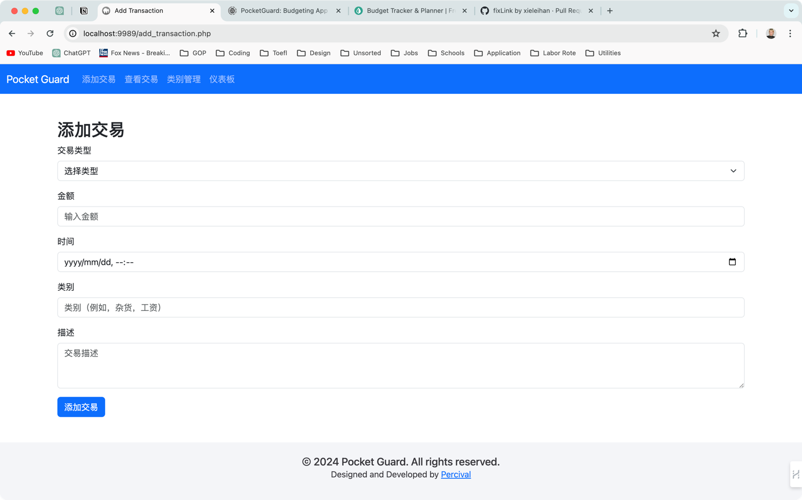  
  
3. 创建`view_transaction.php`  
```html
<!DOCTYPE html>  <html lang="en">    
    <head>    
        <meta charset="UTF-8">    
        <?php include 'common/resource.php'; ?>    
        <script src="https://cdn.jsdelivr.net/npm/chart.js"></script>    
        <title>查看交易</title>    
    </head>    
    <body>    
        <?php include 'common/nav.html'; ?>    
        <div class="container mt-5">    
            <h2>交易列表</h2>    
            <table class="table">    
                <thead>    
                    <tr>    
	                    <th>日期</th>  
						<th>类型</th>  
						<th>类别</th>  
						<th>金额</th>  
						<th>描述</th>
                    </tr>    
                </thead>    
                <tbody>    
                      
                </tbody>    
            </table>    
        </div>    
    
        <?php include 'common/footer.html'; ?>    
    </body>    
    
</html>  
```  

- **添加模拟数据**  
  我们需要一些模拟数据来填充该界面，以展示页面的样式和功能。旨在  
  帮助我们更好地了解页面的布局和交互，对最终的展示有一个更清晰的预期
```html
<tbody>    
    <?php    
    // Fake data    
    $transactions = [    
        ["date" => "2023-12-01", "type" => "Expense", "category" => "Groceries", "amount" => 100, "description" => "Weekly groceries"],    
        ["date" => "2023-12-02", "type" => "Income", "category" => "Salary", "amount" => 2000, "description" => "Monthly salary"],    
        ["date" => "2023-12-03", "type" => "Expense", "category" => "Rent", "amount" => 500, "description" => "Monthly rent"],    
        ["date" => "2023-12-04", "type" => "Expense", "category" => "Utilities", "amount" => 150, "description" => "Utility bills"],    
        ["date" => "2023-12-05", "type" => "Expense", "category" => "Entertainment", "amount" => 200, "description" => "Movie tickets"]    
    ];    
    
    // Output data of each row    
    foreach($transactions as $transaction) {    
        echo "<tr>    
                <td>" . $transaction["date"] . "</td>    
                <td>" . $transaction["type"] . "</td>    
                <td>" . $transaction["category"] . "</td>    
                <td>" . $transaction["amount"] . "</td>    
                <td>" . $transaction["description"] . "</td>    
             </tr>";    
    }    
?>  </tbody>  
```


**效果图✨**  
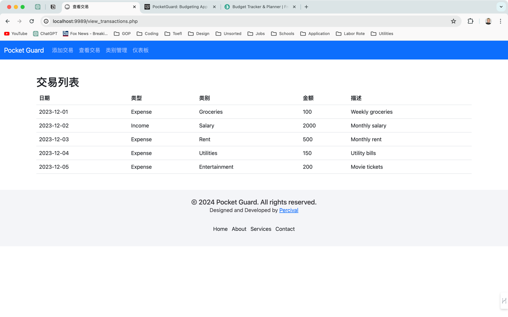  

4. 创建`manage_categories.php`
```html
<!DOCTYPE html>  
<html lang="en">  
    <head>  
        <?php include 'common/resource.php'; ?>  
        <title>类别管理</title>  
    </head>  
    <body>  
        <?php include 'common/nav.html'; ?>  
        <div class="container mt-5">  
            <h2>类别管理</h2>  
            <form action="process_add_category.php" method="post" class="mb-4">  
                <div class="input-group">  
                    <input type="text" name="category_name" class="form-control" placeholder="New Category Name" required>  
                    <button type="submit" class="btn btn-primary">添加类别</button>  
                </div>  
            </form>  
            <table class="table">  
                <thead>  
                    <tr>  
                        <th>类别名称</th>  
                        <th style="text-align: right">操作</th>  
                    </tr>  
                </thead>  
                <tbody>  
                    
                </tbody>  
            </table>  
        </div>  
  
        <?php include 'common/footer.html'; ?>  
    </body>  
</html>
```  
- **添加模拟数据**
```html
<<?php  
                    // Fake data  
                    $categories = [  
                        ["id" => 1, "name" => "Groceries"],  
                        ["id" => 2, "name" => "Salary"],  
                        ["id" => 3, "name" => "Rent"],  
                        ["id" => 4, "name" => "Utilities"],  
                        ["id" => 5, "name" => "Entertainment"]  
                    ];  
  
                    // Output data of each row  
                   foreach ($categories as $category) {
                        echo "<tr>
                                <td>" . $category["name"] . "</td>
                                <td>
                                    <div style='text-align: right;'>
                                        <a href='edit_category.php?id=" . $category["id"] . "' class='btn btn-secondary btn-sm'>编辑</a>
                                        <a href='delete_category.php?id=" . $category["id"] . "' class='btn btn-danger btn-sm'>删除</a>
                                    </div>
                                </td>
                             </tr>";
                    }
?>  
```  

  

**效果图✨**  
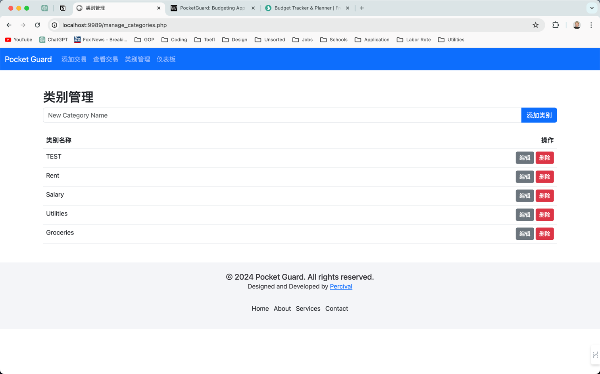

5. 创建`dashboard.php`
```html
<!DOCTYPE html>  
<html lang="zh-CN">  
    <head>  
        <?php include 'common/resource.php'; ?>  
        <title>仪表板</title>  
    </head>  
    <body>  
        <?php include 'common/nav.html'; ?>  
        <div class="container mt-5">  
            <h2>仪表板</h2>  
            <div class="row">  
                <div class="col-md-4">  
                    <div class="card text-center">  
                        <div class="card-body">  
                            <h5 class="card-title">总余额</h5>  
                            <p class="card-text">$1,200</p>  
                        </div>  
                    </div>  
                </div>  
                <div class="col-md-4">  
                    <div class="card text-center">  
                        <div class="card-body">  
                            <h5 class="card-title">本月总收入</h5>  
                            <p class="card-text">$3,000</p>  
                        </div>  
                    </div>  
                </div>  
                <div class="col-md-4">  
                    <div class="card text-center">  
                        <div class="card-body">  
                            <h5 class="card-title">本月总支出</h5>  
                            <p class="card-text">$1,800</p>  
                        </div>  
                    </div>  
                </div>  
            </div>  
            <div class="row mt-4">  
                <div class="col-md-7">  
                    <h4>每月支出细分</h4>  
                    <canvas id="monthlyExpenseChart"></canvas>  
                </div>  
                <div class="col-md-7">  
                    <h4>收入 vs. 支出</h4>  
                    <canvas id="incomeVsExpenseChart"></canvas>  
                </div>  
            </div>  
        </div>  
        <?php include 'common/footer.html'; ?>  
    </body>  
</html>
```  
**效果图✨**  
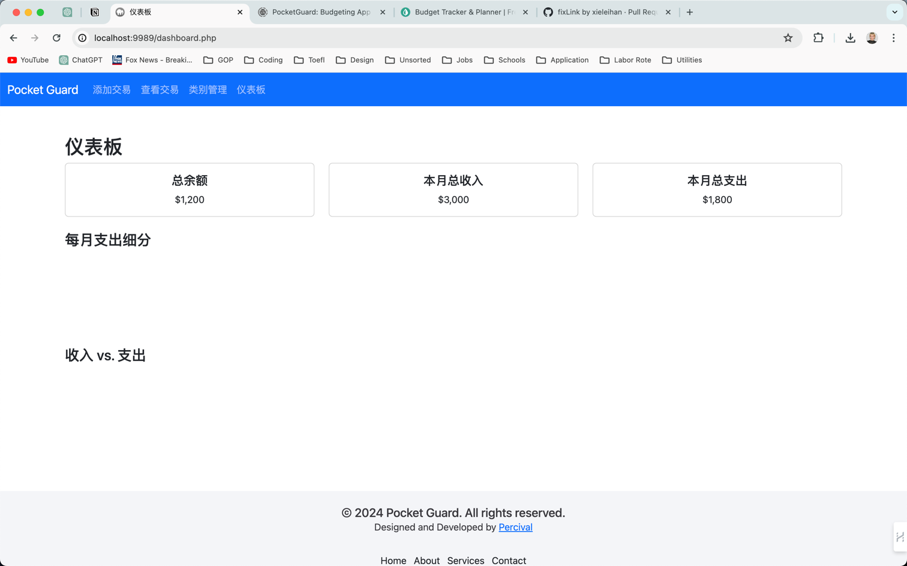


## 2.数据库配置
### 2.1 创建数据库表
创建该项目需要的数据库与数据库表
1. 创建数据库`pocket_guard`,并选择
```sql  
 CREATE DATABASE pocket_guard; USE pocket_guard;  
```  

2. 创建交易表`transactions
```sql  
CREATE TABLE transactions (
	id INT AUTO_INCREMENT PRIMARY KEY,
    type INT,
    amount DECIMAL ( 10, 2 ),
    datetime int(10),
    cid INT,
	description TEXT 
);
```  
- **`id`**: 唯一标识每条交易的自增主键
- **`type`**: 交易类型 1: 收入, 2: 支出
- **`amount`**: 交易金额，以十进制格式存储，保留两位小数
- **`datetime`**: 交易发生的日期和时间
- **`cid`**: 记录交易类别表的id
- **`description`**: 交易描述，包括有关交易的详细信息


**插入数据**
```sql  
INSERT INTO transactions (type, amount, datetime, cid, description) VALUES
(1, 100.00, 1703662617, 1, 'Salary received'),
(2, 50.25, 1703749000, 2, 'Grocery shopping'),
(2, 20.50, 1703835400, 3, 'Dinner at restaurant'),
(1, 150.00, 1703921800, 1, 'Freelance work payment'),
(2, 35.75, 1704008200, 2, 'Online bill payment');

```  


3. 创建交易类型表`categories`
```sql  
CREATE TABLE categories (
	id INT AUTO_INCREMENT PRIMARY KEY,
	name VARCHAR ( 50 ) NOT NULL 
); 
```  
- **`id`**: 唯一标识每个类别的自增主键。
- **`name`**: 类别名称，限制为最大长度为50的字符串，不能为空。

**插入数据**

```sql  
INSERT INTO categories (name) VALUES 
('Groceries'),
('Salary'),
('Rent'),
('Utilities'),
('Entertainment');
```  


### 2.2 创建数据库配置文件

**步骤：**
<hr>

1. 在项目文件夹下，创建文件夹 `config`该文件夹用于存放配置类文件

      


2. 创建数据库配置文件`db.php`
```php  
<?php  define('DB_HOST', 'localhost');  define('DB_USER', 'root');  define('DB_PASS', 'root');  define('DB_NAME', 'pocket_guard');  define('DB_PORT', '3307');    
    
$conn = mysqli_connect(DB_HOST, DB_USER, DB_PASS, DB_NAME, DB_PORT);    
    
// CONNECTION TEST /*if ($conn->connect_error) {  die("Connection failed: " . $conn->connect_error);}  echo "Connected successfully";*/  // /CONNECTION TEST  ?>  
```  

3. 在`resource.html` 添加数据库配置文件
```php  
<?php include 'config/db.php'; ?>  
```

## 3.项目搭建

### 3.1  类别管理
首先搭建类别管理，我们会在添加交易的时候用到类别管理的数据

### 3.1.1 数据显示
**步骤：**
<hr>

1.将模拟数据切换成数据库的数据


```php
$sql = 'SELECT * FROM categories';
$result = mysqli_query($conn, $sql);
$categories  = mysqli_fetch_all($result, MYSQLI_ASSOC);
```

通过替换原来的内容以动态化写死的数据


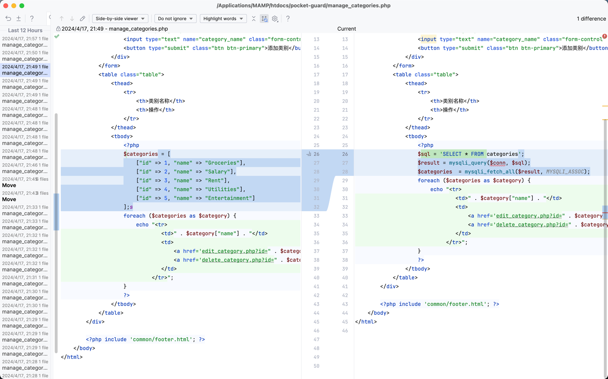


### 3.1.2 添加类别功能

增加一种类别到数据库，以供添加交易记录的时候选择

**步骤：**
<hr>

1. 添加`php`数据处理逻辑

```php
<?php
if (isset($_POST['submit'])) {
    $category_name = $_POST['category_name'];
    $sql = "INSERT INTO categories (name) VALUE('$category_name')";
    mysqli_query($conn, $sql);
}
?>
```

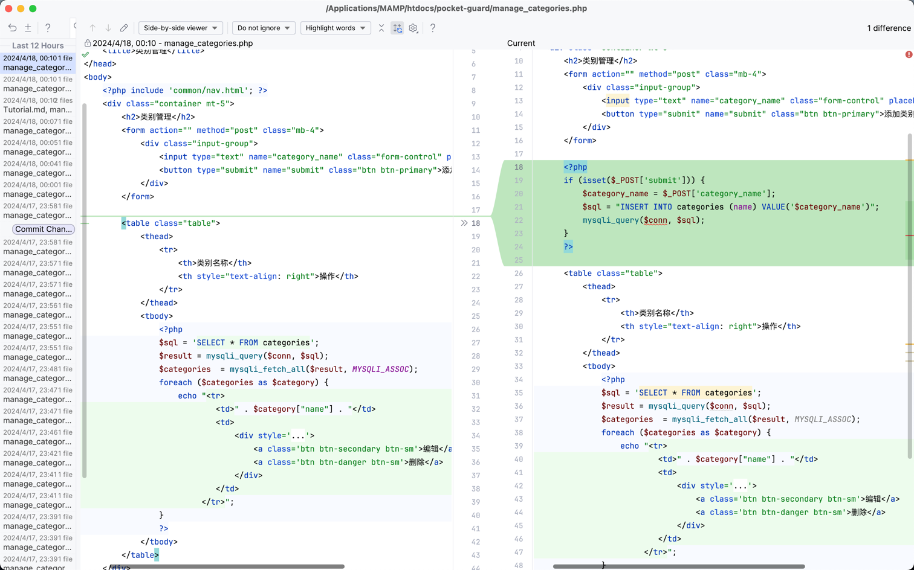

2. 添加空值判断

```php
<?php
if (isset($_POST['submit'])) {
    if (empty($_POST['category_name'])) {
        echo '<div class="alert alert-danger" role="alert">请输入一个类别名称</div>';
    } else {
        $category_name = $_POST['category_name'];
        $sql = "INSERT INTO categories (name) VALUE('$category_name')";
        mysqli_query($conn, $sql);
    }
}
?>
 
```
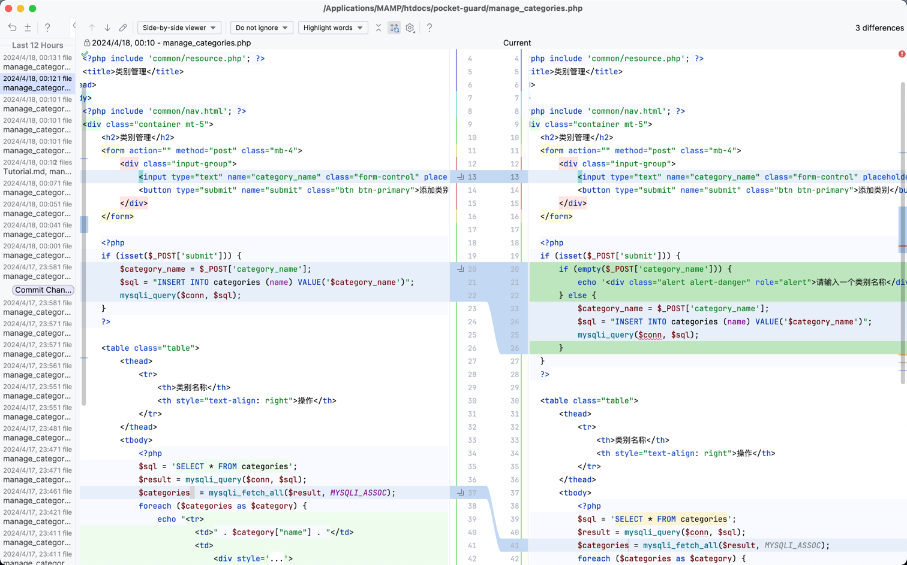


- `<div class="alert alert-danger" role="alert">请输入一个类别名称</div>` 是一个带有 Bootstrap 样式的 div 元素，它会显示为红色背景的框，提示用户输入一个类别名称。
- `class="alert alert-danger"` 是 Bootstrap 的样式类，表示这是一个危险（danger）级别的提示框，通常用于显示错误或警告信息。
- `role="alert"` 是一个辅助性的 ARIA 角色属性，用于定义元素的作用，这里表示这个 div 元素是一个警告框。

**效果图✨**
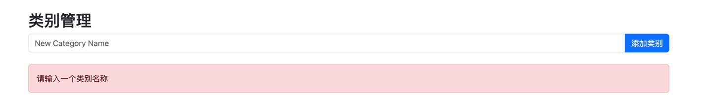

### 3.1.3 编辑类别功能

1. 修改编辑按钮

    添加了 data-id 和 data-name 属性，用于在模态框中显示对应的类别信息。

```html
<a class='btn btn-secondary btn-sm' data-bs-toggle='modal' data-bs-target='#editCategoryModal' data-id='" . $category['id'] . "' data-name='" . $category['name'] . "'>编辑</a>
```

- `data-bs-toggle='modal'`: 这个属性告诉 Bootstrap 模态框插件在单击按钮时要显示一个模态框。

- `data-bs-target='#editCategoryModal'`: 这个属性指定了要显示的模态框的目标，其值是模态框的 ID，也就是 editCategoryModal。

- `data-id='" . $category['id'] . "'`: 这个属性用于存储类别的 ID 值，以便在模态框中使用。

- `data-name='" . $category['name'] . "'`: 这个属性用于存储类别的名称，以便在模态框中使用。

2. 添加模态

    添加模态，当用户点击编辑的时候弹出widget，用户可以在widget中编辑类别名称
    接着提交修改

```html
<div class="modal fade" id="editCategoryModal" tabindex="-1" aria-labelledby="editCategoryModalLabel" aria-hidden="true">
    <div class="modal-dialog">
        <div class="modal-content">
            <div class="modal-header">
                <h5 class="modal-title" id="editCategoryModalLabel">编辑类别</h5>
                <button type="button" class="btn-close" data-bs-dismiss="modal" aria-label="Close"></button>
            </div>
            <div class="modal-body">
                <form method="post">
                    <div class="mb-3">
                        <label for="updated_name" class="form-label">类别名称</label>
                        <input type="text" class="form-control" id="updated_name" name="updated_name">
                        <input type="hidden" id="category_id" name="id">
                    </div>
                    <button type="submit" name="update" class="btn btn-primary">更新类别</button>
                </form>
            </div>
        </div>
    </div>
</div>
```

```javascript
<script>
    var editCategoryModal = document.getElementById('editCategoryModal');
    editCategoryModal.addEventListener('show.bs.modal', function (event) {
        var button = event.relatedTarget;
        var id = button.getAttribute('data-id');
        var name = button.getAttribute('data-name');
        var modalInputName = editCategoryModal.querySelector('.modal-body input[name="updated_name"]');
        var modalInputId = editCategoryModal.querySelector('.modal-body input[name="id"]');
        modalInputName.value = name;
        modalInputId.value = id;
    });
</script>

```

3. 添加`php`数据处理逻辑

```php
<?php
    if (isset($_POST['update']) && !empty($_POST['updated_name']) && !empty($_POST['id'])) {
        $updated_name = $_POST['updated_name'];
        $category_id = $_POST['id'];
        $sql = "UPDATE categories SET name=? WHERE id=?";
        $stmt = mysqli_prepare($conn, $sql);
        mysqli_stmt_bind_param($stmt, "si", $updated_name, $category_id);
        mysqli_stmt_execute($stmt);
    }
?>
```

这段代码通过使用参数化查询来防止 SQL 注入。参数化查询是一种将 SQL 查询语句与用户提供的数据分开的方法。在这种情况下，SQL 查询中的变量部分（即需要从用户输入中获取的部分）被替换为占位符，而用户提供的数据则作为参数传递给查询。这样做可以防止恶意用户利用输入数据来执行 SQL 注入攻击。

>**SQL 注入**💡
> 
> 常见的网络安全漏洞，攻击者通过在输入字段中注入恶意的 SQL 代码，从而获取或修改数据库中的数据，甚至完全控制数据库服务器。通过使用参数化查询，我们可以确保用户输入的数据不会被解释为 SQL 代码的一部分，从而有效地防止了 SQL 注入攻击。

**效果图✨**
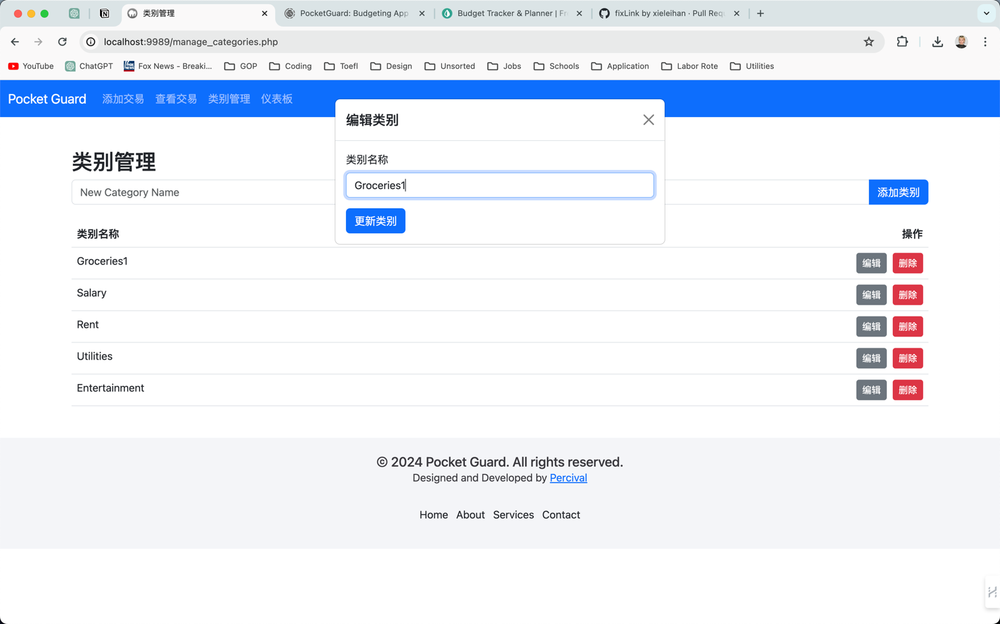

### 3.1.4 删除类别功能

1. 修改删除按钮

    修改按钮，以表单形式提交

```html
<form action='' method='post' style='display: inline-block;'>
    <input type='hidden' name='delete_id' value='" . $category["id"] . "'>
    <button type='submit' name='delete_submit' class='btn btn-danger btn-sm' style='margin-left: 5px;'>删除</button>
</form>
```


2. 添加`php`数据处理逻辑

```php
<?php
    if (isset($_POST['delete_id'])) {
        $delete_id = $_POST['delete_id'];
        $sql = "DELETE FROM categories WHERE id='$delete_id'";
        mysqli_query($conn, $sql);
    }
?>
```

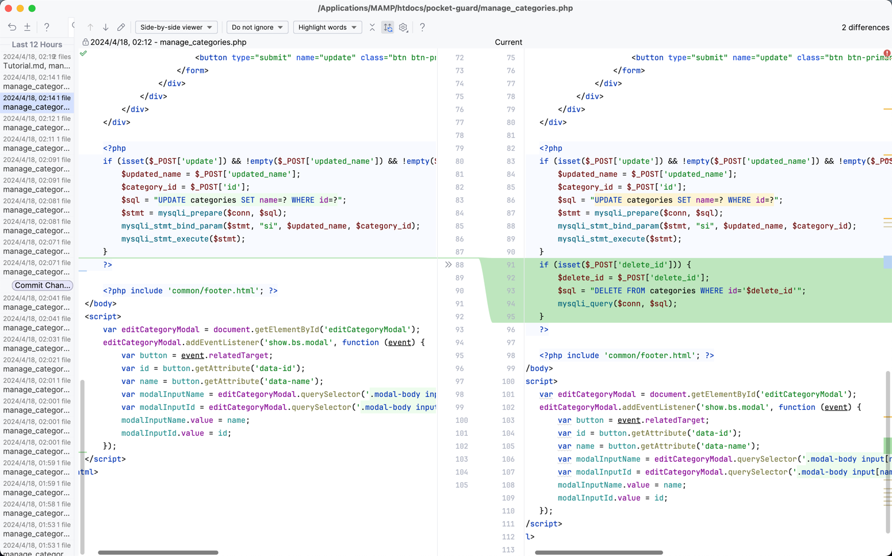


### 3.2 添加交易

### 3.2.1 更新类别选择

将类别改成下拉菜单，数据从数据库里读取

```html
<div class="mb-3">
    <label for="category" class="form-label">类别</label>
    <select class="form-select" id="category" name="category" required>
        <option value="">选择类别</option>
        <?php
        $sql = "SELECT * FROM categories";
        $result = mysqli_query($conn, $sql);
        while ($row = mysqli_fetch_assoc($result)) {
            echo "<option value='" . $row['id'] . "'>" . $row['name'] . "</option>";
        }
        ?>
    </select>
</div>
```

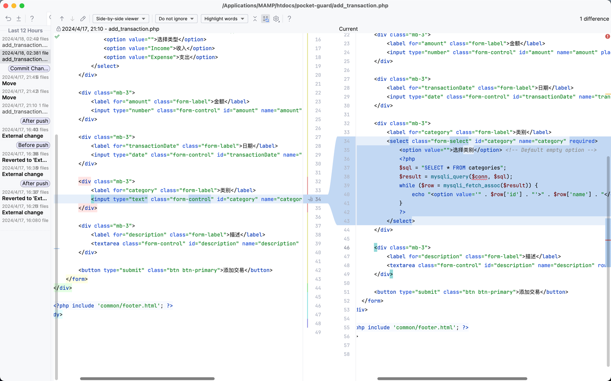

**效果图✨**
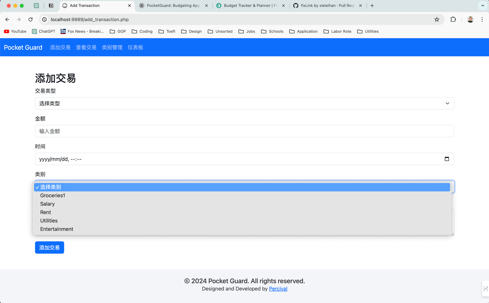

成功连通了自定义交易类别

### 3.2.2 添加交易功能

将页面的各个字段插入到数据库

```php
<?php
if ($_SERVER["REQUEST_METHOD"] == "POST") {
    // Retrieve form data
    $type = $_POST['type'];
    $amount = $_POST['amount'];
    $datetime = strtotime($_POST['datetime']);
    $cid = $_POST['category'];
    $description = $_POST['description'];

    // Sanitize the input
    $type = mysqli_real_escape_string($conn, $type);
    $amount = mysqli_real_escape_string($conn, $amount);
    $datetime = mysqli_real_escape_string($conn, $datetime);
    $cid = mysqli_real_escape_string($conn, $cid);
    $description = mysqli_real_escape_string($conn, $description);

    // Insert transaction into the database
    $sql = "INSERT INTO transactions (type, amount, datetime, cid, description) 
    VALUES ('$type', '$amount', '$datetime', '$cid', '$description')";
    mysqli_query($conn, $sql);
}
?>
```

值得注意的是，我们获取的到的时间数据需要使用`strtotime()`方法转换成时间戳
好处如下
>- **统一格式：** 
> 将时间数据转换为时间戳后，可以在不同的系统和编程语言中更容易地进行处理，因为时间戳是一个统一的数字格式，不受时区、语言环境或日期格式的影响。
>- **便于比较：**
> 时间戳是数字，可以直接进行大小比较。这对于在数据库中对时间进行排序或筛选时特别有用，也方便了对时间的各种计算和处理。
> - **易于操作：** 
> 使用时间戳可以方便地进行日期和时间的各种操作，如加减、格式化、转换等。而在字符串格式中，要进行相同的操作可能会更复杂一些。
> - **兼容性：** 
> 在许多编程语言和数据库系统中，时间戳都是常见的时间表示方法，因此使用时间戳可以提高代码的兼容性。